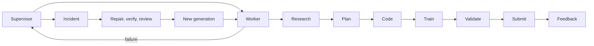

# Kaggle Agent

Kaggle Agent is a competition-agnostic framework for researching public
solutions, planning experiments, generating competition pipeline code, running
local smoke checks, training on Kaggle Kernels, validating artifacts, and
optionally submitting through the Kaggle API. It also includes a conservative,
out-of-process supervisor for incident capture and reviewed self-repair.

## Architecture



## Key features

- Competition-neutral configuration and generated scaffolds.
- Durable stage outputs, replay epochs, and checkpoint-aware resume.
- Exactly-once logical identity for kernel pushes and submissions.
- Kaggle API submissions only; browser access is research-only.
- Optional Telegram approval and operational controls.
- DeepSeek-backed research, planning, coding, and supervisor repair roles.
- Isolated repair worktrees, independent verification, and code review.
- Dry-run and supervisor `observe` modes enabled by conservative defaults.

## Requirements

Python 3.11+, [uv](https://docs.astral.sh/uv/), a Kaggle account, and a
`DEEPSEEK_API_KEY` for LLM-backed stages. Telegram is optional. Put Kaggle
credentials in `~/.kaggle/kaggle.json`; never commit credentials or `.env`.

## Quick start

```bash
git clone https://github.com/Soham-47/kaggle-agent.git
cd kaggle-agent
uv sync --extra dev
cp .env.example .env
kaggle-agent init --competition my_competition --slug kaggle-url-slug
```

Review the generated files under `config/competitions/` and
`competitions/my_competition/pipeline/`. Initialization refuses to overwrite
existing configuration, pipeline, or runtime memory files.

## Add a competition

Use the generic contract template and scaffold:

```bash
kaggle-agent init --competition my_competition --slug kaggle-url-slug
# edit config/competitions/my_competition.yaml
# implement competitions/my_competition/pipeline/
```

`kaggle-agent onboard <slug>` can verify a public Kaggle competition and create
a contract from its sample submission when authenticated access is available.
The older `scripts/new_competition.sh` command remains as a wrapper around
`kaggle-agent init`.

## Run

```bash
kaggle-agent run dry
kaggle-agent --competition my_competition --dry-run
kaggle-agent --competition my_competition --no-dry-run
```

The repository does not select a competition by default. Pass `--competition`
or set one explicitly in `config/settings.yaml` after initialization.

Supervisor modes are explicit and conservative:

```bash
kaggle-agent supervisor --competition my_competition --mode observe
kaggle-agent supervisor --competition my_competition --mode repair_only
```

`auto_safe` remains disabled by default and is not a production rollout
recommendation.

## Safety

- Dry-run is the default.
- Browser submission is prohibited.
- Real submissions require the configured approval flow.
- External actions use a durable outbox and authoritative reconciliation.
- Repairs run in isolated committed generations with independent gates.
- Protected supervisor, approval, outbox, credential, and replay paths are
  excluded from autonomous repair.
- Runtime state is generated outside the tracked templates and can be placed
  under `KAGGLE_AGENT_STATE_ROOT` or `KAGGLE_AGENT_SUPERVISOR_DIR`.

See [docs/safety.md](docs/safety.md) and [docs/supervisor.md](docs/supervisor.md).

## Repository structure

```text
config/competitions/       competition contracts and the generic template
competitions/<id>/         competition-local pipeline code
examples/competition/      small local example scaffold
memory/templates/          sanitized runtime templates
src/kaggle_agent/          shared runtime and supervisor
tests/                     unit and local integration tests
docs/                      architecture, operations, and safety guidance
```

## Development

```bash
uv run python -m compileall -q src
uv run pytest -q -m "not integration"
git diff --check
```

## Status

The supervisor is implemented with `observe` and `repair_only` flows. DeepSeek
and external-service validation depends on local credentials. `AUTO_SAFE` is
disabled by default; unrestricted autonomous repair is not certified.

## License

MIT. See [LICENSE](LICENSE).
