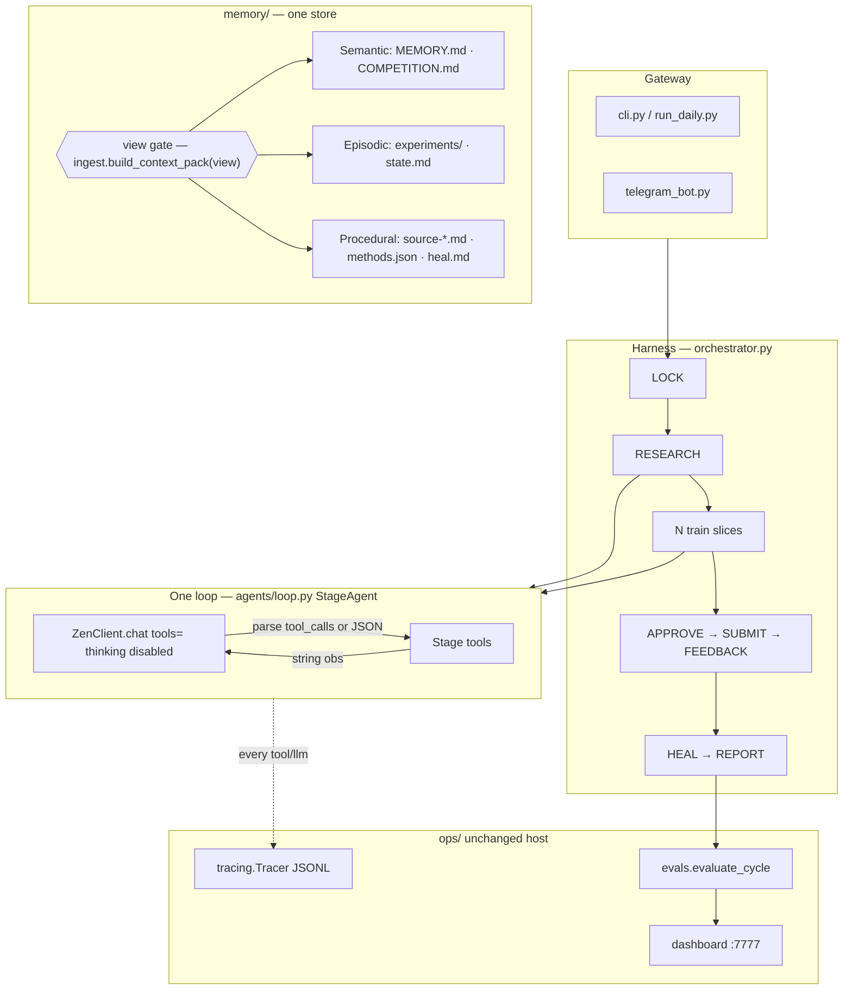
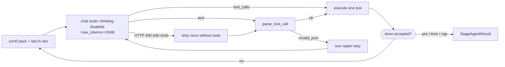
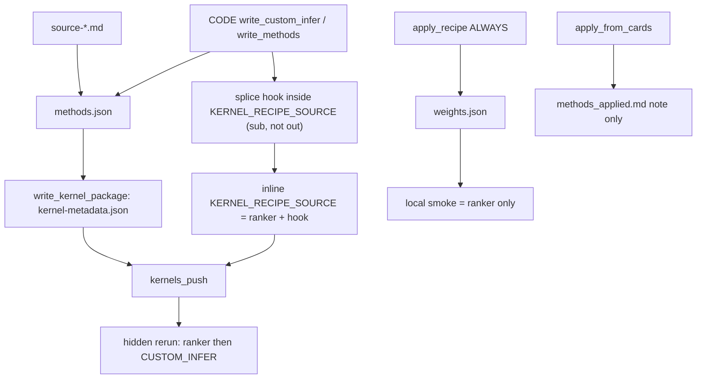

# Memory pillars and stronger RESEARCH / PLAN / CODE loops

| Field | Value |
|-------|--------|
| **Author** | kaggle-agent (design) |
| **Date** | 2026-08-14 |
| **Status** | Draft (rev 3 — CUSTOM_INFER site) |
| **Contest (current)** | `rsna_knee` — public_best **0.526** (metadata ranker). Public kernels ~0.89–0.94 |
| **Inspiration** | [ShenSeanChen/waku-agent](https://github.com/ShenSeanChen/waku-agent) — Harness · Loop · Memory · Eval/LLM-Ops |
| **Scope** | Design only. Parent implements approved PRs. No product code in this slice. |

---

## Overview

kaggle-agent already has Waku’s four boxes: a daily harness (`orchestrator.py`), a generic `StageAgent` loop, markdown memory under `memory/`, and ops (`ops/tracing.py`, `ops/evals.py`, dashboard). Those boxes are wired weakly.

The context pack is a flat dump of four core files plus the last two cards and last two experiments, each cut at 1 500–3 000 characters (`memory/ingest.py`). The loop asks DeepSeek v4-flash to reply with **only** `{"tool","args"}` at `max_tokens=400` and no native tool-calling (`agents/loop.py`). Live eval on 2026-08-14: **69% invalid JSON** on RESEARCH (115/166), plus 141 PLAN and 91 CODE parse failures (`memory/daily/eval_report.json`). RESEARCH almost never writes a card itself (`harvest_cards` ×2 vs `search` ×15). CODE writes `code_brief.md` then the orchestrator **always** runs `apply_recipe` (metadata ranker) and never changes the inlined infer path. That is why we are stuck at 0.526 while public kernels attach weight packs, discover hidden test IDs, and rank-average.

This design keeps **one markdown store** (`memory/`). It maps Waku’s semantic / episodic / procedural pillars onto the files we already have, and adds a **deterministic retrieval gate** (stage views, not a second LLM and not SQLite). It upgrades `StageAgent` to **parse-only** native OpenAI-style tools on a string transcript (protocol A), with JSON fallback. RESEARCH must harvest. PLAN must write a shippable step. CODE’s first score path is a **`CUSTOM_INFER` hook after the existing ranker** so 0.526 stays a floor; full recipe replace is a later optional PR. Existing traces, evals, and the dashboard stay the source of truth. Closed eval does **not** block SUBMIT by default.

---

## Background & Motivation

### Current state (facts)

| Layer | Today | File |
|-------|--------|------|
| Harness | RESEARCH → N× (PLAN, CODE, smoke, kernel, validate) → approve → submit → feedback → heal | `src/kaggle_agent/orchestrator.py` |
| Loop | `StageAgent.run`: LLM → parse JSON → one tool → observe; last **8** transcript turns as one user string; stop on `done` / time / turn cap | `src/kaggle_agent/agents/loop.py` |
| LLM | `ZenClient.chat` sends no `tools`; returns `content` then `reasoning_content`; **drops** `message.tool_calls`. `llm.provider: deepseek` → `api.deepseek.com`. `FallbackClient.chat` does not forward extra kwargs | `llm/zen_client.py`, `llm/fallback.py`, `config/settings.yaml` |
| RESEARCH | Same loop; tools include `harvest_cards` / `write_card`; `accept_done` = `cards_feasible`; offline `no_zen_sequence=["harvest_cards","deep_research"]` | `research/agent.py`, `orchestrator._research_tools` |
| PLAN | `write_plan` fill-in `DEFAULT_HYPOTHESIS` if empty; `accept_done` = wrote + `plan_is_ready` | `agents/plan.py` |
| CODE | `write_brief` (done if file exists) + optional `write_methods`; then **always** `apply_recipe` then `apply_from_cards` | `agents/code.py`, `orchestrator._code` |
| `apply_recipe` | Fits metadata ranker → `pipeline/weights.json` for **local smoke** | `competitions/<id>/pipeline/recipe.py` |
| `apply_from_cards` | Writes `pipeline/methods_applied.md` **only**. Does not attach datasets | same file |
| Kernel | `exec`s `kernel_recipe.py`, inlines `KERNEL_RECIPE_SOURCE`; if missing/empty/`submission.csv` absent → **silent constant-0.5 notebook**. Pins come from `write_kernel_package` reading sanitized `methods.json` | `train/notebook_builder.py` |
| Local smoke | `_ranker_smoke` needs `weights.json`; else `run_local_smoke` writes **constant 0.5**. Smoke does **not** exec `KERNEL_RECIPE_SOURCE` | `train/local_smoke.py` |
| Memory ingest | CORE = MEMORY, COMPETITION, state, research; last 2 `source-*.md`; last 2 `experiments/*.md` | `memory/ingest.py` |
| Not in pack | `heal.md`, `daily/`, `pending_submit.md`, `kernel_job.md`, older cards | `ops/snapshot.py` `NOT_IN_PACK` |
| Ops | JSONL traces, usage ledger, 5 deterministic checks, dashboard | `ops/` |
| Submit | API first; `submit.browser_fallback: true` tries browser-harness after MCP/API fail. AGENTS.md says never browser-submit | `orchestrator._submit`, `config/settings.yaml` |

`loop.md` is implemented in `src/kaggle_agent/loop.py` but **does not exist on disk** and is **not ingested**. Adaptive slice count already lives in code (`next_n` in `LoopState`). Call sites: `orchestrator._resolve_loop_n`, `orchestrator._update_loop_after_feedback`, `notify/commands.py` (`_status_text`), tests (`test_loop_adapt.py`, `helpers.py`).

### Pain points (quantified)

1. **Tool calls are unreliable.** `parse_tool_call` + `max_tokens=400` + “ONLY JSON” is the live 69% invalid-json failure. DeepSeek thinking is on by default and **counts against `max_tokens`**. Live traces hit `tokens_out: 400` with 1 600–1 800 chars of truncated CoT. `ZenClient.chat` never sends a `tools` array and drops `tool_calls`.
2. **RESEARCH does not harvest on the happy path.** Offline, `no_zen_sequence` works. With a live model the first 40 turns are often `invalid_json` / `search` / `pull_kernel`. `harvest_cards` ignores args and `_source_cards` hardcodes `reset=True`.
3. **CODE cannot change infer.** `accept_done` is `brief_path.is_file()`. Orchestrator then fits the metadata ranker every slice. Cards become a sidecar note (`methods_applied.md`), not a new infer path. A full rewrite of `KERNEL_RECIPE_SOURCE` can silently become a 0.5 notebook if the constant is missing.
4. **Context is the same blob for every stage.** RESEARCH does not need two old experiments. PLAN never sees `heal.md` (`decision_next: tune`). CODE gets 3 000-char MEMORY prefs it cannot act on.
5. **Episodes do not close.** `write_experiment` writes `public_score: none` and FEEDBACK does not patch that file. `_feedback` overwrites `state.public_best` with the latest score with **no** better-than-best check.
6. **Eval does not change the cycle.** `evaluate_cycle` runs in `_ops_close` after the cycle. A closed gate does not skip SUBMIT (and must not, by default).

### Why not copy Waku

Waku uses SQLite + FTS5, an LLM retrieval gate, batched consolidation, a real `messages[]` tool conversation (Anthropic `tool_use` + `tool_result`), and a chat-shaped loop (~95 lines). We run a **batch daily contest loop**, one competition at a time, with a human `/yes` before submit. Markdown is already the memory store (`AGENTS.md`: “Never invent a second memory store”). A real `messages[]` port on DeepSeek requires appending the full assistant message (`content` + `reasoning_content` + `tool_calls`) plus `role: tool` / `tool_call_id` or the API returns HTTP 400. That is a larger rewrite than PR1. Steal the **pillars and the eval split**, not the database and not Waku’s message protocol.

---

## Goals & Non-Goals

### Goals

1. Map Waku semantic / episodic / procedural + retrieval gate onto **existing markdown**, with a clear per-stage pack.
2. Make tool calls reliable enough that `invalid_json_rate` ≤ 30% on a live cycle (current eval bar in `ops/evals.py`).
3. RESEARCH must harvest or write at least one implementable card every cycle (safety net if the model never calls the tool).
4. PLAN must write a shippable step (hypothesis + approach in `{baseline,tune,recipe,new}` + a copyable step that is not the dry-run default).
5. CODE must be able to change `pipeline/methods.json` and a **`CUSTOM_INFER` hook** inside `kernel_recipe.py`, not only a brief. The metadata ranker stays the floor (always `apply_recipe` in this design).
6. One `StageAgent`. One `must_first` list. Contest-agnostic host. Fewer new files, not more.
7. Reuse `ops/` traces, evals, dashboard. Add checks; do not replace the stack.

### Non-goals

- SQLite, vector DB, mem0, or a second memory tree.
- Multi-agent / graph workflows (Waku `waku/graph/`). The daily phase list is already the graph.
- Waku-style `messages[]` tool conversation in PR1 (protocol B). Deferred until parse-only is proven.
- Full replace of `KERNEL_RECIPE_SOURCE` as the first CODE path. Later optional PR after a live kernel proves the hook.
- Native Anthropic-only APIs. We stay OpenAI-compatible (`ZenClient` → DeepSeek / Zen / NVIDIA).
- Letting CODE import sibling `.py` into the Kaggle notebook (host constraint: inline the recipe).
- Turning on GPU (`kernel.enable_gpu` stays false unless settings + host allow it).
- Rewriting `DeepResearcher` recursion (it remains a RESEARCH **tool**).
- Changing live submit policy in this design (browser fallback stays as the **existing host** setting; see Security).
- Autonomous multi-slice product decisions. One approved implement slice at a time unless the user grants autonomy.

---

## Key Decisions

Each decision is locked for implementation unless a later review marks it `wontfix` or the user overrides it.

### KD1 — Stay on markdown; map pillars, do not add pillar files

**Decision.** Keep a single store: `memory/`. Do **not** create `semantic.md` / `episodic.md` / `procedural.md`. Do **not** add SQLite.

**Rationale.** `AGENTS.md` already names the ingested files. New pillar files would either duplicate CORE or become a second store. Waku needs a DB because it is a chat assistant with FTS over years of notes. We have one contest, a handful of durable facts, and dated experiment files.

### KD2 — Deterministic retrieval gate (stage views), not an LLM judge

**Decision.** Replace the single `build_context_pack()` blob with `build_context_pack(root, view=...)` where `view` ∈ `{research, plan, code, heal, ops}`. Each view selects files and char budgets. PLAN/CODE get a `retrieve` tool for on-demand keyword reads (landed in PR4, not PR2).

**Rationale.** Waku’s gate asks “does this turn need memory?” We already know the stage. A stage view is cheaper, testable, and cannot 69%-fail JSON.

### KD3 — What each pillar is in *this* repo

| Waku pillar | Our files | Role |
|-------------|-----------|------|
| **Semantic** (durable facts) | `MEMORY.md` (user, goals, lessons, active-contest numbers), `COMPETITION.md` (slug, metric, labels, deadline) | Rarely changes. Always short. |
| **Episodic** (dated events) | `experiments/<id>.md`, `state.md` (heartbeat + `loop_*`), `kernel_job.md`, `pending_submit.md`, `daily/` | What we tried and what scored. Daily logs stay **out** of the LLM pack. |
| **Procedural** (how to act) | Method cards `research-deep/source-*.md`, `## Method cards` / `## Deep research digest` in `research.md`, `competitions/<id>/pipeline/methods.json`, `heal.md` ladder, hard rules in system prompts (not `AGENTS.md` dumped raw) | CODE implements this. |
| **Working memory** | Stage system prompt + **turn 0 = view pack** + last N tool observations | Ephemeral per `StageAgent.run`. |

`research.md` Kaggle snapshot (limits, LB, kernel list) is bulky. The gate keeps only the digest headings in PLAN/CODE, and a short snapshot excerpt in RESEARCH.

### KD4 — One `StageAgent`; one `must_first`; no `no_zen_sequence`

**Decision.** Keep `src/kaggle_agent/agents/loop.py` as the only loop. `ResearchAgent` becomes a factory `make_research_agent(...)` that returns `StageAgent`. Re-export old names in `research/agent.py`.

Delete the `no_zen_sequence` constructor arg. The **only** prefix list is `must_first: list[str]`. Before any LLM call, if those tools are unused and present, return them in order. Args for a forced call are host-computed (not the model’s `{}` blindly): RESEARCH’s `harvest_cards` gets `reset=` from `cards_feasible` (KD6). If `zen is None`, after unused `must_first` tools run, return `done` (today’s no-zen stop). Do not keep a second list for the offline path.

Stage factories set `must_first` **per run**:

| Stage | `must_first` |
|-------|----------------|
| RESEARCH | `["harvest_cards"]` if `not cards_feasible`, else `[]` |
| PLAN | `[]` (orchestrator already writes an experiment file if the agent wrote nothing) |
| CODE | `[]` (offline: orchestrator does not invent a hook; `accept_done` fails closed) |

**Rationale.** Two lists that both mean “run these with empty args” is how live RESEARCH gets the offline sequence or PLAN forces `write_plan` with `{}` on a live client.

### KD5 — Protocol A: parse-only native tools + string transcript

**Decision (locked).** PR1 does **not** replace the string transcript with a Waku `messages[]` tool conversation.

Each LLM turn stays two messages: `system` + `user`, where the user string is:

1. **Turn 0 (always):** the stage context pack (the `context` argument to `StageAgent.run`).
2. **Then** the last N observation lines (`tool=… result=…`), N = 12.

Do **not** send only `transcript[-12:]` if that would drop turn 0 after a burst of `invalid_json`. Pin pack + tail.

`ZenClient.chat` gains optional `tools=` / `tool_choice=` and optional `extra_body=`. On DeepSeek official (`api.deepseek.com`) **tool turns**, send `thinking: disabled` (via `extra_body` or the body field the API accepts). `max_tokens` for RESEARCH / PLAN / CODE tool turns is **≥ 2048** (config default **2048** all three). Parse OpenAI-style `message.tool_calls` into `client.last_tool_calls`. Return type stays **`str`** (content / reasoning_content for the JSON fallback). **Do not introduce `ChatResult` in PR1.**

If `tool_calls` is empty, `parse_tool_call` on the text. On `invalid_json`, retry **once** with a repair user turn. If the provider returns **HTTP 400** on a request that included `tools=`, retry **once** without `tools=` (fail open to JSON). Document this in `zen_client.py`, not only in Rollout.

`FallbackClient.chat` **must** forward `tools`, `tool_choice`, and `extra_body` to the inner client, and **copy** `last_tool_calls` and `last_usage` from the client that succeeded. Today it only forwards `temperature` / `max_tokens`; with two provider keys, native calls would silently disappear.

`tool_choice`:

- `"required"` until this run has successfully executed the stage write tool (`harvest_cards` / `write_card`, `write_plan`, `write_methods` / `write_custom_infer`).
- Then `"auto"`.
- `done` **stays in the tool schema** the whole time so `required` can legally pick it. `accept_done` still rejects early `done`.

System prompts in `research/agent.py`, `agents/plan.py`, `agents/code.py` drop “Reply with ONLY JSON” as the primary protocol. Keep one fallback line: if you cannot call a tool, output `{"tool": name, "args": {}}`.

PR1 includes a recorded fixture (preferred) or one live smoke against DeepSeek official `tools=` + `thinking: disabled`.

**Rationale.** Live failure is thinking eating a 400-token cap, plus dropped `tool_calls`. Protocol B (full assistant + `tool_call_id`) is correct for a multi-turn provider conversation and is **out of PR1**. Parse-only fits today’s orchestrator.

### KD6 — RESEARCH write contract + harvest reset

**Decision (locked).**

1. If `cards_feasible` is already true at RESEARCH start: **skip force**. `must_first=[]`. Agent may `judge_cards` / `done`. `harvest_cards` if the model calls it uses **`reset=False`**.
2. If `not cards_feasible`: **force** `harvest_cards` first with **`reset=True`** (wipe and rewrite). Do **not** require a prior `judge_cards` to wipe thin leftover files. Host sets reset **before** the forced call (the tool does not need the model to pass `reset`).
3. `write_card` rejects junk (`step_is_junk`, fake `dataset/model` pins) then `merge_digest` + `write_methods_sidecar` (sanitized).
4. After the agent stops, if still not `cards_feasible`, orchestrator calls `_source_cards(reset=True)` once. Emit a `tool` trace `stage=research tool=harvest_cards source=safety_net`. Cycle continues (fail-soft). Eval `research_wrote_card` counts agent or safety-net writes.

**`harvest_cards` args:** `reset: bool | None = None`. If `reset` is omitted, the tool sets `reset = not cards_feasible(...)`. Forced `must_first` passes `reset=True` explicitly.

**`_source_cards(result, *, reset: bool)`** — stop hardcoding `reset=True`. `run_source_card_research(..., reset=)` already exists.

**Rationale.** Live dest already has six `source-*.md`. If they are not feasible and harvest keeps them (`reset=False`), `write_methods_sidecar` unions junk pins and `cards_feasible` stays false forever.

### KD7 — PLAN write contract: shippable step

**Decision.**

- Remove the `hypothesis or DEFAULT_HYPOTHESIS` fill-in inside `write_plan`. Empty hypothesis → **reject**, `wrote` stays unset.
- Reject `steps` that are empty, `step_is_junk`, **or** equal/contain `DEFAULT_HYPOTHESIS` (`dry-run default: schema-valid 0.5 baseline then improve`).
- `approach` ∈ `{baseline, tune, recipe, new}`.
- If `heal.decision_next` ∈ `{recipe, new}`, **reject** `approach=baseline`. No prose escape hatch (“unless the hypothesis names a card step”).
- `accept_done` stays the **stricter** current pair: `state["wrote"]` **and** `plan_is_ready(hypothesis, approach)` after a non-rejected write. Do not weaken to “any write_plan call.”

Persist the three lines on the experiment file when write succeeds. Put `heal.md` **only** in the PLAN view (decision + note, 400 chars).

Orchestrator `_plan` may still record a fallback experiment for bookkeeping if the agent wrote nothing; that fallback **must not** count as `plan_shippable` in eval.

**Rationale.** `step_is_junk` only catches `dataset/model`. The dry-run default is how we stay on the ranker. The old heal exception was not testable without contest ifs in `plan.py`.

### KD8 — CODE first path is a `CUSTOM_INFER` hook; ranker stays the floor

**Decision (locked; Open Q2).** Do **not** full-replace `KERNEL_RECIPE_SOURCE` in the first CODE path. Full replace is a **later optional PR** after a live kernel (no SUBMIT) proves the hook.

**How this file actually runs (locked).** `competitions/<id>/pipeline/kernel_recipe.py` is a **wrapper**. The only payload that reaches Kaggle is the string `KERNEL_RECIPE_SOURCE = r''' … '''`. `notebook_builder._recipe_source` execs the wrapper and inlines that string. Module-level Python next to the constant **never runs on Kaggle**.

In the live RSNA recipe (`kernel_recipe.py` ~839–849), the ranker table is `sub` (a DataFrame: `ID_COL` + labels). `out = WORK / "submission.csv"` is a **Path**, then `sub.to_csv(out)`. Hooking `out` is wrong.

**PR5a lands markers inside the raw string**, immediately after `sub` is fully built and **before** `to_csv`. Contest file owns the `ctx` dict and the call. Host `agents/code.py` only splices the **function body** between the markers. **No RSNA label lists or mount paths in `code.py`.**

Exact site (inside `KERNEL_RECIPE_SOURCE`, names from this contest file; another contest uses its own table name in **its** recipe, not in the host):

```python
sub = pd.DataFrame({ID_COL: test_ids})
# ... align columns to sample ...

# === CUSTOM_INFER START ===
def CUSTOM_INFER(sub, ctx):
    """Optional post-ranker hook. `sub` is the ranker table (id + labels).
    Return the same shape. Default is identity (0.526 floor).
    """
    return sub
# === CUSTOM_INFER END ===
ctx = {
    "root": ROOT,
    "work": WORK,
    "labels": LABELS,
    "id_col": ID_COL,
}
sub = CUSTOM_INFER(sub, ctx)

out = WORK / "submission.csv"
sub.to_csv(out, index=False)
```

`ctx` is built in the **contest** file next to the call (paths, mounts, `LABELS`). `write_custom_infer` must not invent or require a `ctx` shape in `code.py`.

CODE tools:

| Tool | Effect |
|------|--------|
| `read_cards` / `read_plan` / `read_methods` | unchanged, tighter budgets |
| `read_file` | scoped read (`ALLOWED_READ`) |
| `write_methods` | existing `methods_payload_ok` **plus** `sanitize_methods_payload` |
| `write_custom_infer` | replace **only** the function body between the markers **inside** `KERNEL_RECIPE_SOURCE` |
| `write_brief` | human note; **not** sufficient for `done` |
| `done` | methods sidecar valid **and** this run called `write_methods` or `write_custom_infer` |

**`write_custom_infer` host contract (PR5a, still always `apply_recipe`):**

1. Size of the hook body ≤ 64 KiB (not 200 KiB of a pasted notebook).
2. Reject hook text that contains the wrapper’s string delimiter (`'''` today). A hook with `'''` would terminate `KERNEL_RECIPE_SOURCE` and break or reinterpret the wrapper.
3. After splice: `ast.parse` + `compile` the **wrapper** file **and** `ast.parse` / `compile` the **extracted** `KERNEL_RECIPE_SOURCE` string as a module (or at least the spliced hook snippet as a module). Wrapper-only parse is **not** enough — garbage inside the raw string still compiles the wrapper.
4. Exec the wrapper in an empty dict (same as `notebook_builder._recipe_source`) and require `KERNEL_RECIPE_SOURCE` to be a non-empty `str`.
5. That extracted string must contain `submission.csv`, `CUSTOM_INFER`, both markers, and a call on the **table** (`sub = CUSTOM_INFER(sub, ctx)` in this contest). It must **not** be the only check that the wrapper `.py` mentions those tokens.
6. Reject relative imports and `from pipeline.` / `import pipeline` **inside the extracted `KERNEL_RECIPE_SOURCE`** (sibling `.py` is not importable on Kaggle).
7. Reject secret-like tokens (`API_KEY`, `BEGIN PRIVATE`, `kaggle.json`). Internet-off on the kernel is the real exfil control (`enable_internet` stays false).
8. Do not delete the ranker body. Do not hook the Path `out`. Markers missing inside the raw string → reject. PR5a lands the identity hook + call at the `sub` / `to_csv` site in the contest file in the same PR as the tool.

**Orchestrator `_code` (this design — both 5a and 5b):**

```
# 1) Agent may update methods.json and/or CUSTOM_INFER hook
# 2) apply_from_cards(workspace)  → methods_applied.md ONLY (not pins)
# 3) apply_recipe(...)            → ALWAYS in this design (weights.json, ranker floor)
# 4) later KERNEL_TRAIN:
#    write_kernel_package reads sanitized methods.json → kernel-metadata.json
#    and inlines KERNEL_RECIPE_SOURCE (ranker + hook)
```

PR5b only hardens the hook path (do not fall back to smoke CSV for approve/submit when `wrote_custom_infer`; trace `code_hook=written|identity`). It does **not** skip `apply_recipe`.

**Local smoke does not execute the hook.** `_ranker_smoke` reads `weights.json`. Schema-valid smoke is **not** evidence the hook works. A live kernel without SUBMIT is the real check. When `wrote_custom_infer`, `_validate_sub` / approve / submit **must not** fall back to the smoke CSV; require kernel `output/submission.csv`.

**Rationale.** Full replace can exec-fail or drop the constant and ship 0.5. A hook keeps 0.526 as a floor and stays contest-agnostic in the host.

### KD9 — Close the episodic loop (score write-back), do not LLM-consolidate

**Decision.** FEEDBACK, when it has a numeric public score, patches the experiment file for the **submitted** id: `pending.exp_id` if that approval/CSV was what submitted, else `result.experiment_id` after slice pick (the validating slice, not a discarded `-s1` if `-s3` won). Fields: `public_score`, `submission`, `kernel`.

Update `state.public_best` and `MEMORY.md` Active contest `public_score` **only** when the new score is strictly better given `competition.metric_direction`. Today `_feedback` blindly overwrites `public_best` with latest. That stops.

When picking last-N experiments for the pack, prefer files with a numeric `public_score`, then mtime. **Until PR7 lands, that sort key is inert** (every file is `public_score: none`). PR2 may implement the comparator; it no-ops until PR7 writes scores.

No LLM consolidation pass.

### KD10 — Fold unused `loop.md` into `state.md`

**Decision.** Add **real dataclass fields** on `AgentState` (or `save_state` drops them): `loop_last_score`, `loop_prev_score`, `loop_last_n`, `loop_next_n`, `loop_note`. `load_loop` / `save_loop` read/write those fields. If `memory/loop.md` exists and state keys are missing, migrate once and stop writing `loop.md`.

Call sites that must keep working (PR7): `loop.load_loop`, `save_loop`, `update_loop_from_score`, `orchestrator._resolve_loop_n`, `orchestrator._update_loop_after_feedback`, `notify/commands.py` `_status_text`, tests that call `save_loop`.

Do not ingest loop keys as their own prompt section.

### KD11 — Observability: extend evals, do not replace ops

**Decision.** Keep `Tracer`, `evaluate_cycle`, `persist_report`, dashboard `build_snapshot`. Add deterministic checks (see Observability). Update `STAGE_TOOLS` and memory notes (remove “CODE writes a brief then always runs apply_recipe” as the *only* CODE story; ranker still runs, hook is the new write).

### KD12 — Eval gate vs SUBMIT (default: observe only)

**Decision (locked).** Closed eval **does not** block SUBMIT. `eval.block_submit: false`. `Settings.block_submit` property (PR6). If later true, `_submit` checks after approval and **before** MCP/API: skip a **live** submit when latest `memory/daily/eval_report.json` has `passed: false`; heal `note: eval gate closed`. Dry-run exempt. Telegram `/yes` still required.

---

## Proposed Design

### Architecture



### Daily cycle

```mermaid
sequenceDiagram
  participant O as Orchestrator
  participant G as View gate
  participant A as StageAgent
  participant Z as ZenClient
  participant M as memory/ + workspace

  O->>O: Kaggle snapshot then browser pages
  O->>G: pack view=research
  alt not cards_feasible
    O->>A: must_first harvest_cards reset=True
  end
  A->>Z: chat(tools, thinking disabled, max_tokens>=2048)
  Z-->>A: tool_calls (parse-only)
  A->>M: harvest_cards / write_card
  alt still not cards_feasible
    O->>M: safety-net _source_cards reset=True
  end
  loop train slices
    O->>G: pack view=plan
    O->>A: PLAN write_plan
    O->>G: pack view=code
    O->>A: CODE write_methods and/or write_custom_infer
    O->>M: apply_from_cards note; apply_recipe weights always
    O->>O: smoke ranker; kernel = ranker + hook; validate
  end
  O->>O: telegram /yes → submit → feedback patches submitted experiment
  O->>M: heal.md
  O->>O: persist_report evaluate_cycle
```

### Memory views (the retrieval gate)

`build_context_pack(root, view="plan", workspace=None) -> ContextPack`

Two numbers per view: **per-key cap** (one section) and **pack cap** (sum after caps). `as_prompt_block(max_chars_per_section=)` uses the per-key default for that view unless a row overrides it.

| View | Include (key → per-key cap) | Pack cap | Exclude |
|------|-----------------------------|----------|---------|
| **research** | `COMPETITION.md` 1 500; `MEMORY.md` Lessons + Active contest 1 500; `state.md` (`public_best`, `proposals_used`, `max_proposals`, `note`) 800; `research.md` digest-first, snapshot trimmed 1 200 | **8 000** | experiments, heal, daily, **full** `source-*.md` (if already feasible, agent `done`s; `judge_cards` reads disk — not the pack) |
| **plan** | `MEMORY.md` 2 000; `COMPETITION.md` 1 500; `state.md` 1 000; research Method cards + digest 2 500; last 2 `source-*.md` 2 000 each; last 2 experiments 1 500 each (scored-then-mtime; inert until PR7); `heal.md` decision+note 400; `methods.json` 1 500 | **14 000** | `daily/`, `pending_submit.md`, templates, `deep-*.md` |
| **code** | `COMPETITION.md` 1 500; `state.public_best` 200; `plan_text` 3 000; last 2 cards 2 000 each; `methods.json` 1 500; last 1 experiment 1 500; `kernel_recipe.py` 4 000 (enough to see markers + hook) | **12 000** | MEMORY user prefs, heal, research snapshot, daily |
| **heal** | Not an LLM pack. `decide_next` stays pure Python. | — | — |
| **ops** | Dashboard lists plan-view membership plus a `view=` field. | — | secrets, `.env` |

`as_prompt_block` grows optional `order: list[str]` so procedural sections (cards, methods) render **before** semantic dump.

**`retrieve` (PR4, PLAN and CODE tools — not PR2):**

```
retrieve(query: str, scope: "cards"|"experiments"|"research"|"memory" = "cards") -> str
```

| `scope` | Files |
|---------|--------|
| `cards` | `memory/research-deep/source-*.md` only |
| `research` | `memory/research.md` only |
| `experiments` | `memory/experiments/*.md` |
| `memory` | `MEMORY.md`, `COMPETITION.md`, `state.md` |

Never `deep-*.md`, `daily/`, `pending_submit.md`, `*secret*`. At most 4 hits × **800 chars of the matching file** (scan the **full** file for the query, then return a window around the first hit). Not “first 80 lines only” (copyable steps sit lower on cards). Refuse paths outside `memory/` and `competitions/<id>/pipeline/`.

Working memory: **turn 0 = pack**, plus last **12** observations, each observation truncated to 4 000 chars.

### File layout after this design (no new memory files)

```
memory/
  MEMORY.md              # semantic
  COMPETITION.md         # semantic
  state.md               # episodic heartbeat + loop_* fields
  research.md            # snapshot + Method cards + Deep digest
  heal.md                # procedural ladder (PLAN view only)
  pending_submit.md      # episodic, not in LLM pack
  kernel_job.md          # episodic, not in LLM pack
  research-deep/
    source-*.md          # procedural cards (last 2 in PLAN/CODE)
    deep-*.md            # DeepResearcher reports; not in pack; not retrieve
  experiments/*.md       # episodic
  daily/                 # logs, traces, eval_report; never in pack
  templates/             # new-competition helpers; never in pack

competitions/<id>/pipeline/
  methods.json           # procedural sidecar (workspace, not memory/)
  kernel_recipe.py       # wrapper; hook markers live INSIDE KERNEL_RECIPE_SOURCE (on `sub`, not Path `out`)
  code_brief.md          # note only
  methods_applied.md     # generated note, not pins
  weights.json           # apply_recipe; local smoke only
```

### Loop internals



**One tool per turn.** Extra `tool_calls` in one response: execute the first; tell the model the rest were ignored.

**`must_first` only** (KD4). RESEARCH force harvest uses host `reset=True` when thin.

Emit `tool=done_rejected` when `accept_done` fails.

### RESEARCH harvest quality

Same bar as `cards_feasible`: non-junk copyable step; datasets pass `_valid_attach_ref`; model pins pass `valid_model_pin` or omitted; digest heading after `merge_digest`. Sanitize before writing `methods.json`. Template `card_from_notebook` only if the LLM card is empty.

### CODE / kernel data flow



---

## API / Interface Changes

### `ZenClient.chat` — PR1 (no `ChatResult`)

```python
# before
def chat(self, model, messages, *, temperature=0.2, max_tokens=1024) -> str: ...

# after — still returns str
def chat(
    self,
    model: str,
    messages: list[dict[str, Any]],
    *,
    temperature: float = 0.2,
    max_tokens: int = 2048,
    tools: list[dict[str, Any]] | None = None,
    tool_choice: str | dict | None = None,
    extra_body: dict[str, Any] | None = None,
) -> str:
    # merge extra_body into POST body (thinking: disabled on DeepSeek tool turns)
    # parse message.tool_calls → self.last_tool_calls: list[tuple[str, dict]]
    # self.last_usage already exists
    # on HTTP 400 and tools is not None: retry once with tools=None
```

```python
# FallbackClient.chat — same signature; must forward tools/tool_choice/extra_body
# after a successful inner chat:
self.last_tool_calls = list(getattr(spec.client, "last_tool_calls", []) or [])
self.last_usage = getattr(spec.client, "last_usage", None) or {"tokens_in": 0, "tokens_out": 0}
```

```python
def openai_tools(names: dict[str, str], params: dict[str, dict]) -> list[dict]:
    """names: tool -> description; params: JSON Schema objects."""
```

### `build_context_pack`

```python
def build_context_pack(
    root: Path | None = None,
    *,
    view: str = "plan",
    workspace: Path | None = None,
    last_experiments: int | None = None,
    plan_text: str = "",
) -> ContextPack: ...
```

`view="plan"` default preserves today’s CORE+cards+experiments tests.

### `StageAgent`

```python
must_first: list[str] | None = None          # replaces no_zen_sequence
must_first_args: dict[str, dict] | None = None  # e.g. harvest_cards: {reset: True}
tool_schemas: list[dict] | None = None
max_tokens: int | None = None               # default 2048 from config
```

Delete `no_zen_sequence`.

### `ResearchAgentSettings` + `Settings._agent_config`

Today the dataclass is only `max_minutes`, `max_tool_turns`. `_agent_config` does not read `max_tokens`.

```python
@dataclass(frozen=True)
class ResearchAgentSettings:
    max_minutes: float = 15.0
    max_tool_turns: int = 40
    max_tokens: int = 2048
```

`_agent_config` reads `raw.get("max_tokens", 2048)`.

### CODE read/write surface

```python
ALLOWED_WRITE = {
    "pipeline/methods.json",
    "pipeline/kernel_recipe.py",  # only via write_custom_infer (marker splice)
    "pipeline/code_brief.md",
    "pipeline/methods_applied.md",
}

ALLOWED_READ = ALLOWED_WRITE | {
    "pipeline/weights.json",
    "pipeline/ranker.py",
    "pipeline/schema.py",
}

def read_file(rel: str) -> str:
    """Resolve under competitions/<id>/ only. Reject .. and paths not in ALLOWED_READ."""

def write_custom_infer(source: str) -> str:
    """Splice the function body between markers INSIDE KERNEL_RECIPE_SOURCE.
    Reject if source contains the wrapper delimiter ('''). Parse wrapper and
    extracted recipe string. Do not hook the Path named out. ctx stays in the
    contest file."""
```

No general `write_file`.

### Orchestrator `_code` (locked sequence)

```python
# after agent
apply_from_cards(workspace)  # note file only
apply_recipe(workspace, data_dir=self.root / "data")  # always; weights.json
# do not treat apply_from_cards as pinning
```

`make_code_agent` returns `(agent, state)` with `wrote_methods` / `wrote_custom_infer`.

### `Settings.block_submit` (PR6)

```python
@property
def block_submit(self) -> bool:
    return bool(self.raw.get("eval", {}).get("block_submit", False))
```

`_submit`: after approval checks, before MCP/API, if `not dry and self.settings.block_submit` and latest `eval_report.json` has `passed is False`: set `submit_ok=False`, skip network, heal note. Default false.

---

## Data Model Changes

No SQL. Markdown / JSON only.

### `memory/state.md`

Real `AgentState` fields:

```
- loop_last_score: none
- loop_prev_score: none
- loop_last_n: none
- loop_next_n: 3
- loop_note: none
```

### `memory/experiments/<id>.md`

FEEDBACK patches the **submitted** experiment id:

```
- kernel: <ref>
- submission: <kaggle status>
- public_score: <float or none>
```

### `competitions/<id>/pipeline/methods.json`

Unchanged shape. **Every** `write_methods` and harvest sidecar write calls `sanitize_methods_payload` (today only pin-heal / `write_kernel_package` sanitize).

### `config/settings.yaml`

```yaml
eval:
  block_submit: false   # KD12; Settings.block_submit; live submit only

research:
  agent:
    max_minutes: 15
    max_tool_turns: 40
    max_tokens: 2048
plan:
  agent:
    max_tokens: 2048
code:
  agent:
    max_tokens: 2048
```

### What we delete / stop writing

| Item | Action |
|------|--------|
| `memory/loop.md` | Stop writing; migrate if found |
| `no_zen_sequence` | Deleted; `must_first` only |
| `ResearchAgent` as a distinct class | Factory only (compat alias OK) |
| “ONLY JSON” as the primary protocol | Fallback only |
| Full `KERNEL_RECIPE_SOURCE` replace in first CODE path | Deferred optional PR |
| Unconditional skip of `apply_recipe` | Not in this design; ranker always runs |

---

## Alternatives Considered

### A1 — SQLite + FTS5 (Waku default)

| | |
|--|--|
| **Pros** | Queryable history; dashboard Data tab |
| **Cons** | Second store vs `AGENTS.md`; FTS overkill for <100 experiments |
| **Verdict** | Rejected unless markdown `retrieve` fails after two contests |

### A2 — Keep JSON-only tools; only raise `max_tokens` and tighten prompts

| | |
|--|--|
| **Pros** | Smallest diff |
| **Cons** | Live 69% is structural (CoT + dropped `tool_calls`). A 1024 cap with thinking on still starves `write_card` |
| **Verdict** | Insufficient as primary. JSON remains the **fallback** after native parse and HTTP 400 fail-open |

### A3 — Skip the LLM loop for RESEARCH; always run `run_source_card_research`

| | |
|--|--|
| **Pros** | Deterministic cards; kills RESEARCH invalid_json |
| **Cons** | No `pull_kernel` / discussion follow-up |
| **Verdict** | Rejected as the only path. Kept as **safety net** (KD6) |

### A4 — External coding agent (`code_agent.cmd`)

| | |
|--|--|
| **Pros** | Better patches |
| **Cons** | Extra process; sandbox leaks |
| **Verdict** | Out of scope |

### A5 — LLM retrieval gate

| | |
|--|--|
| **Pros** | Waku story |
| **Cons** | Every stage already knows its subset; another JSON surface |
| **Verdict** | Rejected. Stage views are the gate |

### A6 — Orchestrator always harvests once; do not invert `no_zen_sequence` as the live path

From the loop-tools ticket: call `_source_cards` once after the Kaggle snapshot (before or after the agent). Do not make “force first tool” the live harvest.

| | |
|--|--|
| **Pros** | One obvious host call; no `must_first` / empty-args games; reset policy lives in one function |
| **Cons** | Harvests even when cards are already feasible (API + Zen card spend). Tool traces would not show `harvest_cards` unless we emit a synthetic event anyway. Model cannot decide “cards are good, pull one more kernel” before a wipe |
| **Verdict** | **Rejected as the only harvest.** Kept as the **post-loop safety net**. `must_first` + host `reset` is better when thin (shows up as a real tool turn for eval) and **skips** when `cards_feasible`. The safety net still guarantees one cycle write if the model never calls the tool |

### A7 — `CUSTOM_INFER` hook after the ranker (vs full recipe replace)

| | |
|--|--|
| **Pros** | 0.526 floor; `apply_recipe` / smoke weights stay valid; host contract is a marker splice + compile, not “rewrite 2k lines”; contest-specific extractors stay in the contest file |
| **Cons** | A 0.89 kernel that *replaces* the ranker cannot ship until a later optional PR |
| **Verdict** | **Accepted as the first CODE path (locked).** Full replace is optional after a live kernel proves the hook |

### A8 — Parse-only native tools (A) vs Waku `messages[]` (B)

| | |
|--|--|
| **Pros of A** | Fits today’s 2-message loop; no `tool_call_id` / `reasoning_content` round-trip; PR1 stays small |
| **Cons of A** | Provider cannot see prior tool results as first-class `role: tool` messages (only the string transcript) |
| **Pros of B** | Correct DeepSeek multi-turn tools; closer to Waku |
| **Cons of B** | HTTP 400 if `reasoning_content` / ids are dropped; rewrites `StageAgent` working memory |
| **Verdict** | **A for PR1 (locked).** Revisit B after invalid_json is under 30% |

---

## Security & Privacy Considerations

| Threat | Severity | Mitigation |
|--------|----------|------------|
| Secrets in memory or cards | High | No secrets in `memory/`. Hook/card writers reject `API_KEY`, `BEGIN PRIVATE`, `kaggle.json`. Pack never includes `.env` |
| CODE writes a malicious notebook | Medium | `enable_internet` stays **false** — that is the real exfil control. Token scan will not catch `os.environ[...]` if internet is later flipped on. Writes scoped to `ALLOWED_WRITE`. Kernel stays private |
| Prompt injection from public kernels | Medium | Distill “use only source facts”; allowlisted dataset URL shapes; sanitize pins |
| `file://` / internal URLs via `fetch_url` | Medium | **Today there is no scheme check.** `fetch_via_http` is raw `urlopen`. PR3 adds http(s)-only on the RESEARCH `fetch_url` tool (and on `fetch_via_http` if that is the shared helper) |
| Traces leaking secrets | Low | Keep tracing `args_keys` only, not raw args |
| Browser submit | Medium (policy split) | **Existing host:** `submit.browser_fallback: true`; `_submit` tries browser-harness after MCP/API fail on live runs. **AGENTS.md** says never submit via the browser. This design does **not** turn the fallback off (non-goal). Document the split; do not claim submit is API-only |

Auth model unchanged: `~/.kaggle/kaggle.json`, `DEEPSEEK_API_KEY` / `OPENCODE_API_KEY`, Telegram env. None enter markdown.

---

## Observability

Reuse the existing host. No Phoenix/OTel in this design.

### Traces

As today: `cycle_start`, `phase`, `llm`, `tool`, `agent_stop`. Add:

- `tool=done_rejected` when `accept_done` fails
- `tool=harvest_cards` from the safety net (`source=safety_net`)
- `gate` once per stage: `{view, section_keys, chars}`
- `code_hook=written|identity` after CODE
- `code_recipe=applied` (always, this design)

### Deterministic evals

No LLM-as-judge in `evaluate_cycle`.

| Check id | Pass when | Notes |
|----------|-----------|--------|
| `invalid_json_rate` | ≤ 30% **per stage that ran**, and overall | Count RESEARCH + PLAN + CODE |
| `research_wrote_card` | `write_card` or `harvest_cards` (including safety_net) | |
| `methods_pins_valid` | sanitize-clean pins | |
| `cards_feasible` | sidecar + digest | |
| `context_has_method_cards` | PLAN view has a card or Method cards heading | `view="plan"` |
| **`plan_shippable`** | `write_plan` this cycle with non-default, non-junk steps | fail if only `DEFAULT_HYPOTHESIS` |
| **`code_changed_artifact`** | `write_methods` or `write_custom_infer` this cycle | `write_brief` alone fails |
| **`code_hook_compiles`** (new; replaces old `code_not_forced_ranker`) | if `write_custom_infer` ran, wrapper **and** extracted `KERNEL_RECIPE_SOURCE` both parse | wrapper-only parse is a false green |

### Dashboard

Update `STAGE_TOOLS` (`write_custom_infer`, no `no_zen_sequence`). Show view sizes. Keep invalid_json collapse in `ops/terminal.py`.

### Latency / load

| Call | Today | Target |
|------|--------|--------|
| Tool-turn LLM | ~1–3 s, often wasted | same latency, usable turns; 2048 tokens, thinking off |
| RESEARCH | 40 turns × 15 min | harvest turn 1 if thin, then 2–6, then done |
| PLAN / CODE | 20 turns | 3–8 useful turns |

### Alerting

REPORT line: `eval passed=… invalid_json=… code_hook=…`. No new pager.

---

## Rollout Plan

| Flag | Default | Effect |
|------|---------|--------|
| *(native tools)* | on | Send `tools=` when a client exists; JSON + HTTP 400 fail-open |
| `eval.block_submit` | `false` | KD12 |
| `kernel.enable_gpu` | `false` | unchanged |
| `orchestrator.dry_run` | `true` | first validation on dry cycles |
| `submit.browser_fallback` | `true` (existing) | unchanged by this design |

### Stages

1. Land **PR1** (thinking disabled, FallbackClient, 2048, protocol A). No recipe change.
2. Land **PR3**. Dry-run: harvest on turn 1 if cards thin; `reset=True` only then.
3. Land **PR7** (scores) in parallel with **PR2 / PR4** (views + retrieve + PLAN contract). Scored experiment sort is live once PR7 writes numbers.
4. Land **PR5a** (hook tool + compile/extract; **still `apply_recipe`**). Dry-run smoke still writes a schema-valid **ranker** CSV. That is not hook-ok.
5. Land **PR5b** (no smoke fallback for approve/submit when hook written). One live kernel **without** SUBMIT. Confirm attachments + hook in the inlined source.
6. Human `/yes` only after kernel output + pins look real.
7. **PR6** last (evals match behavior). Revisit `eval.block_submit` after two live cycles with `passed: true`.

### Rollback

- PR1: revert; or providers 400 → already fail-open without `tools=`.
- PR5a/5b: revert those diffs; ranker + identity hook remain. Do **not** “rollback” by forcing `write_brief`.
- Full recipe replace is not in tree, so it cannot ship by accident.

---

## Risks

| Risk | Severity | Mitigation |
|------|----------|------------|
| Provider rejects `tools` | Medium | HTTP 400 fail-open without `tools=`; JSON fallback |
| Hook is identity forever; still 0.526 | Medium | Accept as floor; optional later full-replace PR after a live kernel proves the hook |
| Hook ships worse order than ranker | High | Ranker still runs first; hook can be reverted by restoring identity between markers; heal `tune` |
| `write_custom_infer` / missing markers → silent 0.5 notebook | High | Markers must sit **inside** the raw string; parse wrapper **and** extracted source; reject `'''` in the hook |
| Hook spliced onto Path `out` | High | Call is `sub = CUSTOM_INFER(sub, ctx)` before `to_csv`; never `out = CUSTOM_INFER(out, ctx)` |
| Smoke CSV used as submit when kernel skipped | High | PR5b: if `wrote_custom_infer`, do not approve/submit smoke |
| Forced harvest every cycle | Medium | Skip force when `cards_feasible`; `reset=False` then |
| Thin leftover cards never wiped | High | `not cards_feasible` ⇒ `reset=True` (KD6) |
| PLAN/CODE tests assume CORE order | Low | Default `view="plan"` |
| Closing eval gate too early | Medium | Default off |
| `retrieve` dumps a deep report | Low | `deep-*.md` not in any scope |

---

## PR Plan

Do not implement until the user names a PR. Order below is locked for this revision.

**Implement order:** PR1 → PR3 → PR7 ∥ PR2 / PR4 → PR5a → PR5b → PR6 last.

PR5 is **not** the next slice after PR3. The hook contract (KD8) is locked; 5a still always `apply_recipe`.

### PR1 — Reliable tool calls (protocol A)

**Depends on:** nothing  
**Files:** `src/kaggle_agent/llm/zen_client.py`, `src/kaggle_agent/llm/fallback.py`, `src/kaggle_agent/agents/loop.py`, `src/kaggle_agent/config.py` (`ResearchAgentSettings.max_tokens`, `_agent_config`), `src/kaggle_agent/research/agent.py`, `src/kaggle_agent/agents/plan.py`, `src/kaggle_agent/agents/code.py` (system strings; swap `no_zen_sequence` → `must_first`), `tests/test_plan_code_agents.py`, `tests/test_research_agent.py`, new `tests/test_loop_tools.py`  
**Description:** `tools` / `tool_choice` / `extra_body`; parse `tool_calls` onto `last_tool_calls`; **no `ChatResult`**. `FallbackClient` forwards those kwargs and copies `last_tool_calls`. DeepSeek tool turns: `thinking: disabled`. `max_tokens` default 2048. Transcript = turn 0 pack + last 12 obs. One JSON repair retry. HTTP 400 + `tools=` → retry without tools. One `must_first` (PLAN/CODE empty). Recorded DeepSeek fixture or one live smoke. No harvest-reset or recipe behavior change yet (`must_first` for RESEARCH is wired in PR3).

### PR2 — Stage context views

**Depends on:** nothing (merge-friendly with PR1)  
**Files:** `src/kaggle_agent/memory/ingest.py`, `tests/test_ingest.py`, `src/kaggle_agent/ops/snapshot.py`, orchestrator pack call sites, `agents/plan.py` `read_memory`  
**Description:** `build_context_pack(view=...)`. PLAN default = today’s CORE+2 cards+2 experiments. RESEARCH/CODE pass explicit views. **No `retrieve` in this PR** (PR4). Prefer scored experiments in the selector; **inert until PR7** writes `public_score`.

### PR3 — RESEARCH harvest contract

**Depends on:** PR1 (`must_first`, `must_first_args`)  
**Files:** `src/kaggle_agent/research/agent.py`, `src/kaggle_agent/research/source_cards.py`, `src/kaggle_agent/orchestrator.py` (`_research`, `_source_cards(reset=)`, `harvest_cards` args, `fetch_url` http(s)-only), `src/kaggle_agent/research/browser.py` if scheme check lives on `fetch_via_http`, tests `test_research_agent.py`, `test_research_loop.py`  
**Not in this PR:** `agents/code.py`  
**Description:** If not `cards_feasible`: `must_first=["harvest_cards"]` with `reset=True`. If feasible: skip force; harvest default `reset=False`. Safety-net `_source_cards(reset=True)` + trace. Junk-reject `write_card`. http(s)-only `fetch_url`.

### PR4 — PLAN shippable step + heal in view + `retrieve`

**Depends on:** PR2  
**Files:** `src/kaggle_agent/agents/plan.py`, `src/kaggle_agent/agents/code.py` (`retrieve` tool), ingest PLAN view (heal excerpt), `tests/test_plan_code_agents.py`  
**Description:** No DEFAULT fill-in; reject default/junk steps; if `decision_next` in `{recipe,new}` reject `approach=baseline`. `retrieve` with the scope map in Memory views.

### PR5a — `write_custom_infer` + compile/extract; still `apply_recipe`

**Depends on:** PR1 (loop/tools). **Does not depend on PR4** (`approach` already exists on experiments / `result.plan_text`).  
**Files:** contest `pipeline/kernel_recipe.py` (markers + identity hook call), `src/kaggle_agent/agents/code.py`, `src/kaggle_agent/heal/pins.py` (sanitize on `write_methods`), `tests/test_plan_code_agents.py`, `tests/test_orchestrator.py`  
**Description:** Land identity `CUSTOM_INFER` + `ctx` + `sub = CUSTOM_INFER(sub, ctx)` **inside** `KERNEL_RECIPE_SOURCE`, after `sub` is built and before `to_csv` (live file ~839–849). Tool splices only the function body. Host contract (KD8): reject `'''` in hook text; `ast.parse` wrapper **and** extracted recipe string; do not hook Path `out`; `ctx` stays in the contest file. `accept_done` needs methods or hook write. `make_code_agent` returns state. Orchestrator **still always** `apply_from_cards` (note) and `apply_recipe` (weights). No smoke-fallback change yet.

### PR5b — Hook-only submit path (still no ranker skip)

**Depends on:** PR5a  
**Files:** `src/kaggle_agent/orchestrator.py` `_validate_sub` / approve / submit candidate pick, `ops/snapshot.py` notes  
**Description:** If `wrote_custom_infer`, candidate CSV must be kernel output; **do not** fall back to smoke. Trace `code_hook`. Still `apply_recipe` every slice.

### PR6 — Evals + dashboard + REPORT line

**Depends on:** PR1, PR3, PR5b so new check IDs mean something  
**Files:** `src/kaggle_agent/ops/evals.py`, `src/kaggle_agent/ops/snapshot.py`, `src/kaggle_agent/config.py` (`Settings.block_submit`), `orchestrator._submit` (branch after approve, before MCP/API; dry-run exempt), `orchestrator._report`, `config/settings.yaml`, `tests/test_ops.py`  
**Description:** Broaden `invalid_json_rate`; add `plan_shippable`, `code_changed_artifact`, `code_hook_compiles`. `block_submit` default false.

### PR7 — Episodic close-out + fold `loop.md`

**Depends on:** nothing. Land in parallel with PR2/PR4 after PR3.  
**Files:** `src/kaggle_agent/state_md.py`, `src/kaggle_agent/loop.py`, `src/kaggle_agent/memory/write.py`, `orchestrator._feedback`, `orchestrator._resolve_loop_n`, `orchestrator._update_loop_after_feedback`, `notify/commands.py`, `tests/test_state_md.py`, `tests/test_loop_adapt.py`, `tests/test_telegram_commands.py`  
**Description:** Patch **submitted** experiment id; `public_best` / MEMORY only on metric-direction improvement; `loop_*` fields on `AgentState`; stop writing `loop.md`.

---

## Open Questions

1. **Eval vs SUBMIT after JSON is healthy.** Default stays observe-only (`eval.block_submit: false`). Still a product call whether to flip the flag later or never tie eval to SUBMIT.
2. **~~Full replace vs hook~~ — LOCKED.** First CODE path is `CUSTOM_INFER` after the ranker. Full `KERNEL_RECIPE_SOURCE` replace is a later optional PR after a live kernel (no SUBMIT) proves the hook.
3. **Should RESEARCH still run DeepResearcher every cycle?** Tool the model rarely calls (`deep_research` ×1). Option: skip when cards feasible; safety-net deep only when still thin after harvest. Needs a product call.
4. **Card retention across contests.** Wipe `memory/research-deep/` vs archive under `memory/archive/<old_id>/` when `default_competition` changes.
5. **Provider tool support matrix.** PR1 recorded fixture for DeepSeek official. Zen free / NVIDIA still unverified; fail-open covers them.

---

## References

- Waku architecture: <https://github.com/ShenSeanChen/waku-agent/blob/main/docs/architecture.md>
- Waku loop (native tools, ~95 lines): <https://github.com/ShenSeanChen/waku-agent/blob/main/waku/loop/agent.py>
- Repo rules: [`AGENTS.md`](../../AGENTS.md)
- Ingest: [`src/kaggle_agent/memory/ingest.py`](../../src/kaggle_agent/memory/ingest.py)
- Loop: [`src/kaggle_agent/agents/loop.py`](../../src/kaggle_agent/agents/loop.py)
- RESEARCH / cards: [`src/kaggle_agent/research/agent.py`](../../src/kaggle_agent/research/agent.py), [`source_cards.py`](../../src/kaggle_agent/research/source_cards.py)
- PLAN / CODE: [`src/kaggle_agent/agents/plan.py`](../../src/kaggle_agent/agents/plan.py), [`code.py`](../../src/kaggle_agent/agents/code.py)
- Harness: [`src/kaggle_agent/orchestrator.py`](../../src/kaggle_agent/orchestrator.py)
- Smoke 0.5 fallback: [`src/kaggle_agent/train/local_smoke.py`](../../src/kaggle_agent/train/local_smoke.py)
- Evals / traces: [`src/kaggle_agent/ops/evals.py`](../../src/kaggle_agent/ops/evals.py), [`tracing.py`](../../src/kaggle_agent/ops/tracing.py)
- Live eval (69% invalid JSON): [`memory/daily/eval_report.json`](../../memory/daily/eval_report.json)
- Cards review: [`docs/reviews/2026-08-13-cards-quality.md`](../reviews/2026-08-13-cards-quality.md)
- Prior specs: [`docs/specs/slice-08-heal-cron.md`](slice-08-heal-cron.md)

---

## Revision Summary

- Initial draft 2026-08-14: memory pillars on existing markdown; deterministic stage-view gate; native tools + JSON fallback; RESEARCH harvest contract; CODE kernel/methods writes; eval observe-only vs SUBMIT; seven PRs.
- Rev 2 (review pass): locked protocol A (parse-only, thinking disabled, max_tokens ≥ 2048, turn 0 + last N, FallbackClient forwards tools / copies `last_tool_calls`); no `ChatResult`; one `must_first`, deleted `no_zen_sequence`; harvest `reset=True` iff not `cards_feasible`; PLAN rejects default hypothesis and `baseline` when heal says recipe/new; CODE first path is `CUSTOM_INFER` hook with compile/extract contract; always `apply_recipe`; `apply_from_cards` is a note only; no smoke fallback when hook written; eval still does not block SUBMIT; PR order PR1 → PR3 → PR7 ∥ PR2/PR4 → PR5a → PR5b → PR6; added alternatives A6–A8; corrected `fetch_url` and browser-fallback facts.
- Rev 3 (CUSTOM_INFER site): markers + identity hook + call live **inside** `KERNEL_RECIPE_SOURCE`; hook `sub` not Path `out`; parse wrapper **and** extracted string; reject `'''` in hook text; `ctx` built in the contest file, not `code.py`.
